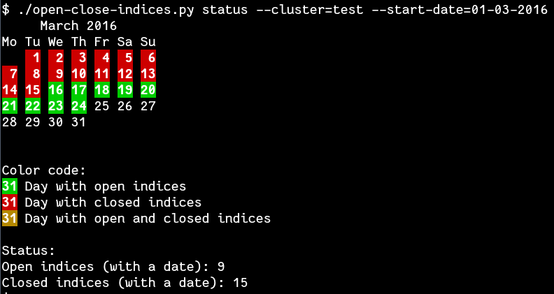

# Elastic Tools from roidelapluie

Here are some scripts I've made to manage the Elastic Stack.

## open-close-indices.py

A script that allows you to open and closes indices with visual feedback. It
also allows you to see the days with open/closed indices.

## shards-management.py

Manage the number of replicas

## find-mapping-conflicts.py

Find Mappings Conflicts

## fix-mapping.py

Fix mapping conflicts

# License

This work is licensed under the GPL-2.0 license.
